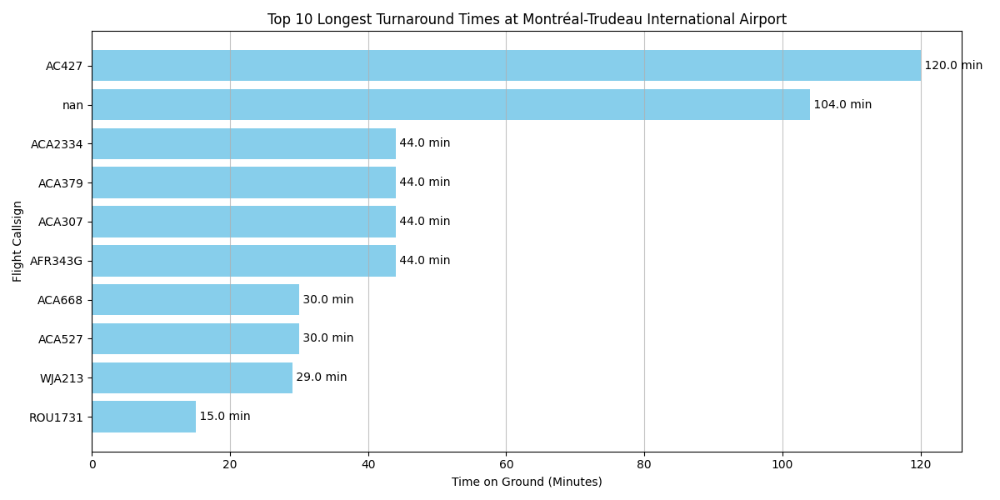

# Automated Airport Operations Monitor & Reporter

This project is a Python-based data pipeline built to demonstrate key software engineering skills for a role in the aviation technology sector. The application monitors real-time aircraft operations at a specified airport, identifies potential turnaround delays, logs data, and generates analytical reports with visualizations.

This tool was specifically designed to align with the responsibilities of the **Developer Intern** role at **Assaia**, showcasing proficiency in Python scripting, third-party API integration, data processing, and process automation.

---

## Live Demo Output

Below is an example of the final analytical report generated by the `reporter.py` script, analyzing real-time data collected from London Heathrow Airport (LHR).



_This chart is automatically generated and saved by the reporting script._

---

## Core Features

- **Real-Time Monitoring (`monitor.py`):**
  - Integrates with the live **OpenSky Network API** to fetch real-time state vectors for aircraft in a specified geographical area.
  - Processes raw data to identify all aircraft currently on the ground.
  - Calculates the time each aircraft has been on the ground and flags those exceeding a configurable threshold (e.g., 90 minutes).
  - **Automated Slack Alerts:** Sends formatted, real-time alerts to a Slack channel for any flagged flights, enabling immediate operational awareness.
- **Historical Data Logging:**
  - Persists all "on-the-ground" aircraft observations to a `turnaround_log.csv` file, building a valuable historical dataset with every run.
- **Offline Analytics & Reporting (`reporter.py`):**
  - Uses the **Pandas** library to load and clean the historical log data, intelligently de-duplicating entries to find the final status of each unique aircraft.
  - Calculates key performance indicators (KPIs) such as average time on the ground and identifies outliers (e.g., the flight parked the longest).
  - Uses the **Matplotlib** library to automatically generate and save a professional bar chart visualizing the top 10 longest turnarounds.

---

## Technical Architecture & Stack

This project was built with a focus on clean code, separation of concerns, and robust error handling.

- **Language:** **Python 3.x**
- **Core Libraries:**
  - `requests`: For making robust HTTP requests to external APIs.
  - `pandas`: For all data manipulation, cleaning, and analysis.
  - `matplotlib`: For creating static data visualizations.
  - `python-dotenv`: For secure management of API keys and credentials.
- **Project Structure:**
  - `src/monitor.py`: The real-time data collection and alerting tool.
  - `src/reporter.py`: The offline data analysis and visualization tool.
  - `src/config.py`: A centralized configuration file for easy changes to parameters like airport coordinates and thresholds.
  - `data/`: Contains the output logs and generated PNG reports.
---

## Architecture & Deployment: A Live 24/7 Pipeline

This project is not just a collection of local scripts; it is a fully deployed, autonomous data pipeline operating 24/7 in a cloud environment. The architecture was designed for reliability and hands-free operation, demonstrating skills in cloud infrastructure, Linux, and process automation.

The operational flow is as follows:

```
+---------------------+      +-------------------------------------------+      +--------------------------------+
|  Cron Scheduler     | ---> |  Bash Script (run_monitor.sh/run_reporter.sh) | ---> |  Python Virtual Environment    |
| (Triggers on schedule)|      |  (Sets up environment, handles logging)   |      |  (Manages dependencies)        |
+---------------------+      +-------------------------------------------+      +--------------------------------+
                                                                                           |
                                                                                           v
+------------------------------------------------------------------------------------------+
|  Python Script (monitor.py / reporter.py)                                                |
|  (Executes core logic: API calls, data processing, visualization)                        |
+------------------------------------------------------------------------------------------+
                                     |
                                     v
+------------------------------------------------------------------------------------------+
|  Actions & Artifacts (Slack alerts, turnaround_log.csv, analysis.png)                    |
+------------------------------------------------------------------------------------------+
```

### Key Components:

*   **Cloud Host:** The entire application is deployed on a **Google Cloud Platform (GCP)** virtual machine. It runs on an `e2-micro` instance, which is part of GCP's "Always Free" tier, demonstrating cost-effective resource management.
*   **Operating System:** The server runs a stable version of **Debian Linux**, a standard environment for professional backend services.
*   **Automation Engine:** Automation is handled by **cron**, the native Linux job scheduler. Two distinct schedules are configured:
    *   The `monitor.py` script runs at a high frequency (e.g., every 15 minutes) to ensure near real-time data collection.
    *   The `reporter.py` script runs once daily to perform analysis and generate the summary visualization.
*   **Reliability & Execution:** Instead of being called directly by cron, each Python script is wrapped in a robust **bash script**. This is a best practice that:
    *   Ensures a consistent and reliable execution environment (`PATH`).
    *   Automatically activates the correct Python virtual environment to manage dependencies.
    *   Redirects all output (both `stdout` and `stderr`) to a dedicated log file (`cron.log`, `reporter.log`) for easy debugging and health monitoring.
---

## Setup and Usage

### Prerequisites

- Python 3.10+
- A Slack account with an Incoming Webhook URL.

### Installation

1.  **Clone the repository:**

    ```bash
    git clone https://github.com/youssefjedidi/airport-operations-pipeline
    cd airport-operations-pipeline
    ```

2.  **Create a virtual environment and activate it:**

    ```bash
    python3 -m venv venv
    source venv/bin/activate
    ```

3.  **Install the required dependencies:**

    ```bash
    pip install -r requirements.txt
    ```

4.  **Configure your environment variables:**
    - Create a file named `.env` in the root of the project.
    - Add your Slack Webhook URL to it:
      ```
      SLACK_WEBHOOK_URL=YOUR_SLACK_WEBHOOK_URL_HERE
      ```
      _(Note: The OpenSky Network API used in this version does not require an API key.)_

### Running the Tools

#### 1. To Monitor Live Operations and Log Data:

This script will fetch live data, send alerts if needed, and append to the `turnaround_log.csv` file.

```bash
python src/monitor.py
```

#### 2. To Generate an Analytical Report:

This script reads the log file and generates a summary and a visual chart in the `data/reports/` directory.

```bash
python src/reporter.py
```

### Reconfiguring for a Different Airport

The tool can be easily reconfigured to monitor any airport by updating the IATA code, airport name, and geographic bounding box in the `src/config.py` file.
